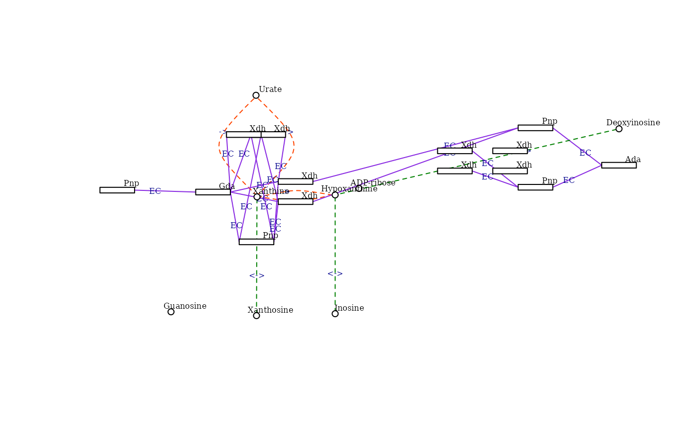

# The \`KEGGemUP\` package: building KEGG pathway graphs and mapping real data results

**Compiled date**: 2026-02-23

**Last edited**: 15-12-2025

**License**: MIT + file LICENSE

## Installation

The first step is installing the package. If you dont have the package
installed you can do so by running:

``` r
install.packages("remotes")     
remotes::install_github("edo98811/KEGGemUP")
```

Then load it.

``` r
library("KEGGemUP")
```

KEGG pathways are used in many bioinformatics contexts, this package
package can make it very easy to implement these in the analysis of real
data.

A very important part of bioinformatics analyses is both data
integration and visiazionation. KEGGemUP aims to facilitate these tasks
by providing functions to parse KEGG pathways and build graph objects,
the idea is then to use these graph to map on them thre results of
differential expression analyses.

KEGG database uses pathway ids to identify each pathway, for example
“hsa00563” is the KEGG pathway ID for “Glycosylphosphatidylinositol
(GPI)-anchor biosynthesis” in humans. You can use these pathway IDs to
download the KGML files for each pathway and then parse them to build
graph objects. The id must have the organism prefix, for example “hsa”
for human pathways, “mmu” for mouse pathways, etc.

These vignette assumes you have already performed a differential
expression analysis and have the results available as a `data.frame`
(which you can easily obtain from edgeR or limma by running
[`as.data.frame()`](https://rdrr.io/pkg/BiocGenerics/man/as.data.frame.html)
on the table of the results for each object). To reproduce this
situation we will now build an example of a differential expression
result using the macrophage dataset from the macrophage package:
[bioconductor
page](https://www.bioconductor.org/packages/release/data/experiment/html/macrophage.html)

To learn more about graph manipulation you can refer to the igraph and
visNetwork documentation:

- [igraph](https://r.igraph.org) Is a package for creating and
  manipulating graphs in R.
- [visNetwork](https://datastorm-open.github.io/visNetwork/) Is a
  package for interactive visualization of graphs in R, an R interface
  to the javascript library vis.js.

``` r
message("--- Loading packages...")
#> --- Loading packages...
suppressPackageStartupMessages({
  library("macrophage")
  library("org.Hs.eg.db")
  library("SummarizedExperiment")
  library("AnnotationDbi")
  library("clusterProfiler")
  library("limma")
  library("igraph")
  library("edgeR")
})
message("- Done!")
#> - Done!

# Load the macrophage dataset ---------------------------------------------------
data(gse)
rownames(gse) <- substr(rownames(gse), 1, 15)  # truncate rownames at 15 characters

# limma analysis ---------------------------------------------------------------
condition <- factor(colData(gse)[, "condition_name"])
design <- model.matrix(~0 + condition)

contrast.matrix <- makeContrasts(
  IFNg_vs_naive = conditionIFNg - conditionnaive,
  levels = design
)

dge <- DGEList(assay(gse))
dge <- calcNormFactors(dge)

cutoff <- 1
drop <- which(apply(cpm(dge), 1, max) < cutoff)
dge <- dge[-drop, ]

voom_mat <- voom(dge, design, plot = FALSE)
fit <- lmFit(voom_mat, design)
fit2 <- contrasts.fit(fit, contrast.matrix)
fit2 <- eBayes(fit2)  # Empirical Bayes moderation

# Gene annotation ---------------------------------------------------------------

anns <- AnnotationDbi::select(
  org.Hs.eg.db,
  keys = rownames(gse),
  columns = c("SYMBOL", "ENTREZID"),
  keytype = "ENSEMBL",
  multiVals = "first"
)
#> 'select()' returned 1:many mapping between keys and columns

# limma results ---------------------------------------------------------------
res_macrophage_IFNg_vs_naive_limma <- topTable(
  fit2,
  coef = "IFNg_vs_naive",
  adjust = "fdr",
  number = Inf,
  confint = TRUE
)

res_macrophage_IFNg_vs_naive_limma$ENTREZID <- anns$ENTREZID[match(rownames(res_macrophage_IFNg_vs_naive_limma), anns$ENSEMBL)]

# Enrichment analysis ----------------------------------------------------------
de_entrez_IFNg_vs_naive_genes <- anns $ENTREZID[
  (!is.na(res_macrophage_IFNg_vs_naive_limma$adj.P.Val)) &
    (res_macrophage_IFNg_vs_naive_limma$adj.P.Valj <= 0.05)
]
```

## Building KEGG pathway graphs and mapping real data results

### Exporting the graph

This is how to build a KEGG pathway graph and the structure of its nodes
and edges.

``` r
graph <- kegg_to_graph("hsa00563")
#> adding rname 'https://rest.kegg.jp/get/hsa00563/kgml'

# Extract all vertex attributes
vertices_df <- igraph::as_data_frame(graph, what = "vertices")

# Extract all edge attributes
edges_df <- igraph::as_data_frame(graph, what = "edges")

DT::datatable(
  vertices_df,
  options = list(scrollX = TRUE)
)
```

``` r

DT::datatable(
  edges_df,
  options = list(scrollX = TRUE)
)
```

### Building KEGG pathway graphs

You can build a KEGG pathway graph from a KEGG pathway ID using the
function
[`kegg_to_graph()`](https://edo98811.github.io/KEGGemUP/reference/kegg_to_graph.md).
The input of this function is a KEGG pathway ID (for example “hsa00563”
for the human Glycosylphosphatidylinositol (GPI)-anchor biosynthesis
pathway) and the output is a graph object representing the pathway.

### Build a graph from a pathway ID and map results to nodes

To map the differential expression results to the nodes of a KEGG
pathway graph you can use `map_results_to_nodes()`. The input of this
function is a graph object built with
[`kegg_to_graph()`](https://edo98811.github.io/KEGGemUP/reference/kegg_to_graph.md)
and a list of differential expression results tables or a single
differential expression results table.

You can also pass as input to `map_results_to_nodes()` a single
`data.frame` with the differential expression results. This dataframe
must contain at least two columns: one with the KEGG feature IDs
(without organism prefix) and another with the values to map to the
nodes (e.g., log2 fold changes). You can pass to the function the names
of these columns if they differ from the default ones with the
parameters `feature_column` and `value_column`.

Note that the KEGG IDs without organism prefix are the the ENTREZ IDs
for genes. For other feature types (e.g., compounds) you will need to
make sure that the IDs in your differential expression results table
match the KEGG IDs used in the graph.

The defualt parameters are:

- `feature_column`: “KEGG_ids”
- `value_column`: “log2FoldChange”

If you have multiple differential expression results tables (for example
if you have one metabolomics and one transcriptomics) to map to the
nodes you can pass a list of lists. Each sublist must contain the
following elements:

- `de_table`: a data.frame with the differential expression results.
- `value_column`: the name of the column in de_table containing the
  values to map to the nodes.
- `feature_column`: the name of the column in de_table containing the
  feature IDs (e.g., ENTREZ IDs) that correspond to the KEGG ids in the
  graph (without organism prefix).

This is an example of how to build such a list of differential
expression results tables. In this case there is only one element, but
ideally you would have one for each omics layer or source you want to
map to the graph nodes.

``` r
de_results_list <-list(
  trans_limma = list(
    de_table = data.frame(res_macrophage_IFNg_vs_naive_limma),
    value_column = "logFC",
    feature_column = "ENTREZID"
  )
)
```

#### Example of usage with the list of DE results tables

We will now take a KEGG pathway from the enrichment results we built
earlier and map the differential expression results to its nodes. As you
can see you simply need to pass to the function the graph object and the
list of differential expression results tables that we defined before.

The workflow is as follows: first we build the graph from the KEGG
pathway ID, then we map the differential expression results to the nodes
of the graph, and at the end we plot the graph using
[`make_kegg_visNetwork()`](https://edo98811.github.io/KEGGemUP/reference/make_kegg_visNetwork.md),
which creates an interactive visualization of the graph using
visNetwork.

``` r
pathway <- "hsa00563"  
graph <- kegg_to_graph(pathway, scaling_factor = 10)
graph <- map_results_to_graph(graph, de_results_list)
#> Warning in vertices_df$de_text[ids_nodes_to_check] <-
#> format(round(as.numeric(vertices_df$de_value), : number of items to replace is
#> not a multiple of replacement length
graph_visnetwork <- make_kegg_visNetwork(graph)
graph_visnetwork
```

#### Example of usage with a single DE results table

Let’s first build a filtered differential expression results table with
only the significant results.

``` r
de_results_limma <-  data.frame(res_macrophage_IFNg_vs_naive_limma)
```

Then we will call the function with this table as input. The parameter
`feature_column` and `value_column` are set to match the column names in
our differential expression results table.

``` r
graph <- kegg_to_graph(pathway)
graph <- map_results_to_graph(graph, de_results_limma, feature_column = "ENTREZID", value_column = "logFC")
#> Using provided value_column: 'logFC'
#>  and provided feature_column: 'ENTREZID'.
#> de_results provided as a single data.frame.
#> Warning in vertices_df$de_text[ids_nodes_to_check] <-
#> format(round(as.numeric(vertices_df$de_value), : number of items to replace is
#> not a multiple of replacement length
graph_visnetwork <- make_kegg_visNetwork(graph)
graph_visnetwork
```

You can also control the palette that is used to map the values to
colors on the nodes with the parameter `palette`. The default is “RdBu”
from RColorBrewer, but you can use any palette supported by
RColorBrewer. To see the available palettes you can run
[`RColorBrewer::display.brewer.all()`](https://rdrr.io/pkg/RColorBrewer/man/ColorBrewer.html).
You can also visit this page: [RColorBrewer
palettes](https://r-graph-gallery.com/38-rcolorbrewers-palettes.html).

``` r
graph <- kegg_to_graph(pathway)
graph <- map_results_to_graph(graph, de_results_limma, feature_column = "ENTREZID", value_column = "logFC", palette = "PiYG")
#> Using provided value_column: 'logFC'
#>  and provided feature_column: 'ENTREZID'.
#> de_results provided as a single data.frame.
#> Warning in vertices_df$de_text[ids_nodes_to_check] <-
#> format(round(as.numeric(vertices_df$de_value), : number of items to replace is
#> not a multiple of replacement length
graph_visnetwork <- make_kegg_visNetwork(graph)
graph_visnetwork
```

#### Igraph Visualisation

Let’s build another pathway as example:

``` r
library(AnnotationDbi)
library(org.Mm.eg.db)
#> 

pathway <- "mmu00230"

g <- kegg_to_graph(pathway) |>
  map_results_to_graph(de_results_list)
#> adding rname 'https://rest.kegg.jp/get/mmu00230/kgml'
```

it can happen that you only want a subset of it, expecially for complex
pathways. For that therfe is the function `make_graph_subset`. You need
to supply to it either entrezids for gene and proteins, or KEGG compound
ids if you wish to use the compounds. We can make a subset of it and try
to visualise it using the igraph function.

``` r
KEGG_to_include <- c("C00262", "C00385", "C00366", "C00294", "C00387",
                 "C01762", "C05512", "C00301", "C01185", "C00455",
                 "22436", "14544", "18950", "11486", "80285", "59027")
subg <- make_graph_subset(g, KEGG_to_include)

make_igraph_visualisation(subg)
```



#### VisNetwork visualisation

Let’s now visualise it using visnetwork.

``` r
make_kegg_visNetwork(subg)
```

#### Loading a downloaded file

You can also download a kgml file from kegg and parse a kegg pathway
directly from it.

``` r
path_file <- KEGGemUP::download_kgml( "mmu04933")

graph_parsed <- kegg_to_graph(pathway_id = "example", kgml_file = path_file)
#> Warning in value[[3L]](cond): Could not retrieve pathway name for ID: example

make_kegg_visNetwork(graph_parsed)
```

### Session info

``` r
sessionInfo()
#> R version 4.5.2 (2025-10-31)
#> Platform: x86_64-pc-linux-gnu
#> Running under: Ubuntu 24.04.3 LTS
#> 
#> Matrix products: default
#> BLAS:   /usr/lib/x86_64-linux-gnu/openblas-pthread/libblas.so.3 
#> LAPACK: /usr/lib/x86_64-linux-gnu/openblas-pthread/libopenblasp-r0.3.26.so;  LAPACK version 3.12.0
#> 
#> locale:
#>  [1] LC_CTYPE=C.UTF-8       LC_NUMERIC=C           LC_TIME=C.UTF-8       
#>  [4] LC_COLLATE=C.UTF-8     LC_MONETARY=C.UTF-8    LC_MESSAGES=C.UTF-8   
#>  [7] LC_PAPER=C.UTF-8       LC_NAME=C              LC_ADDRESS=C          
#> [10] LC_TELEPHONE=C         LC_MEASUREMENT=C.UTF-8 LC_IDENTIFICATION=C   
#> 
#> time zone: UTC
#> tzcode source: system (glibc)
#> 
#> attached base packages:
#> [1] stats4    stats     graphics  grDevices utils     datasets  methods  
#> [8] base     
#> 
#> other attached packages:
#>  [1] org.Mm.eg.db_3.22.0         edgeR_4.8.2                
#>  [3] igraph_2.2.2                limma_3.66.0               
#>  [5] clusterProfiler_4.18.4      SummarizedExperiment_1.40.0
#>  [7] GenomicRanges_1.62.1        Seqinfo_1.0.0              
#>  [9] MatrixGenerics_1.22.0       matrixStats_1.5.0          
#> [11] org.Hs.eg.db_3.22.0         AnnotationDbi_1.72.0       
#> [13] IRanges_2.44.0              S4Vectors_0.48.0           
#> [15] Biobase_2.70.0              BiocGenerics_0.56.0        
#> [17] generics_0.1.4              macrophage_1.26.0          
#> [19] KEGGemUP_0.1.0             
#> 
#> loaded via a namespace (and not attached):
#>   [1] RColorBrewer_1.1-3      jsonlite_2.0.0          tidydr_0.0.6           
#>   [4] magrittr_2.0.4          ggtangle_0.1.1          farver_2.1.2           
#>   [7] rmarkdown_2.30          fs_1.6.6                ragg_1.5.0             
#>  [10] vctrs_0.7.1             memoise_2.0.1           ggtree_4.0.4           
#>  [13] htmltools_0.5.9         S4Arrays_1.10.1         curl_7.0.0             
#>  [16] SparseArray_1.10.8      gridGraphics_0.5-1      sass_0.4.10            
#>  [19] bslib_0.10.0            htmlwidgets_1.6.4       desc_1.4.3             
#>  [22] plyr_1.8.9              httr2_1.2.2             cachem_1.1.0           
#>  [25] lifecycle_1.0.5         pkgconfig_2.0.3         gson_0.1.0             
#>  [28] Matrix_1.7-4            R6_2.6.1                fastmap_1.2.0          
#>  [31] digest_0.6.39           aplot_0.2.9             enrichplot_1.30.4      
#>  [34] ggnewscale_0.5.2        patchwork_1.3.2         crosstalk_1.2.2        
#>  [37] textshaping_1.0.4       RSQLite_2.4.6           filelock_1.0.3         
#>  [40] polyclip_1.10-7         httr_1.4.8              abind_1.4-8            
#>  [43] compiler_4.5.2          withr_3.0.2             bit64_4.6.0-1          
#>  [46] fontquiver_0.2.1        S7_0.2.1                BiocParallel_1.44.0    
#>  [49] DBI_1.2.3               ggforce_0.5.0           R.utils_2.13.0         
#>  [52] MASS_7.3-65             rappdirs_0.3.4          DelayedArray_0.36.0    
#>  [55] tools_4.5.2             otel_0.2.0              scatterpie_0.2.6       
#>  [58] ape_5.8-1               R.oo_1.27.1             glue_1.8.0             
#>  [61] nlme_3.1-168            GOSemSim_2.36.0         grid_4.5.2             
#>  [64] cluster_2.1.8.1         reshape2_1.4.5          fgsea_1.36.2           
#>  [67] gtable_0.3.6            R.methodsS3_1.8.2       tidyr_1.3.2            
#>  [70] data.table_1.18.2.1     xml2_1.5.2              XVector_0.50.0         
#>  [73] ggrepel_0.9.6           pillar_1.11.1           stringr_1.6.0          
#>  [76] yulab.utils_0.2.4       splines_4.5.2           tweenr_2.0.3           
#>  [79] dplyr_1.2.0             treeio_1.34.0           BiocFileCache_3.0.0    
#>  [82] lattice_0.22-7          bit_4.6.0               tidyselect_1.2.1       
#>  [85] locfit_1.5-9.12         fontLiberation_0.1.0    GO.db_3.22.0           
#>  [88] Biostrings_2.78.0       knitr_1.51              fontBitstreamVera_0.1.1
#>  [91] xfun_0.56               statmod_1.5.1           DT_0.34.0              
#>  [94] visNetwork_2.1.4        stringi_1.8.7           lazyeval_0.2.2         
#>  [97] ggfun_0.2.0             yaml_2.3.12             evaluate_1.0.5         
#> [100] codetools_0.2-20        gdtools_0.5.0           tibble_3.3.1           
#> [103] qvalue_2.42.0           BiocManager_1.30.27     ggplotify_0.1.3        
#> [106] cli_3.6.5               systemfonts_1.3.1       jquerylib_0.1.4        
#> [109] Rcpp_1.1.1              dbplyr_2.5.2            png_0.1-8              
#> [112] parallel_4.5.2          pkgdown_2.2.0           ggplot2_4.0.2          
#> [115] blob_1.3.0              DOSE_4.4.0              tidytree_0.4.7         
#> [118] ggiraph_0.9.6           scales_1.4.0            purrr_1.2.1            
#> [121] crayon_1.5.3            BiocStyle_2.38.0        rlang_1.1.7            
#> [124] cowplot_1.2.0           fastmatch_1.1-8         KEGGREST_1.50.0
```
